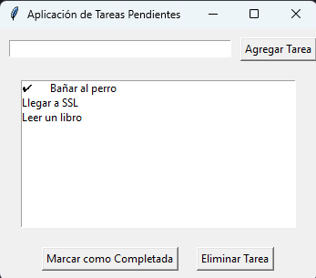

# Aplicación de administración de tareas

El código cumple la función de crear tareas, eliminar tareas previamente creadas y marcar tareas como completadas

## Modo de uso

¿Qué biblioteca debe estar instalada?
R/ La biblioteca llamada tkinter

¿Con qué comando se ejecuta el programa? ¿En qué directorio debe encontrarse en la terminal para ejecutar el programa?
R/ Comando: py ./repositorio/AplicacionTareas.py
Directorio: En el que se clonó el repositorio

## Ejemplo de ejecución

